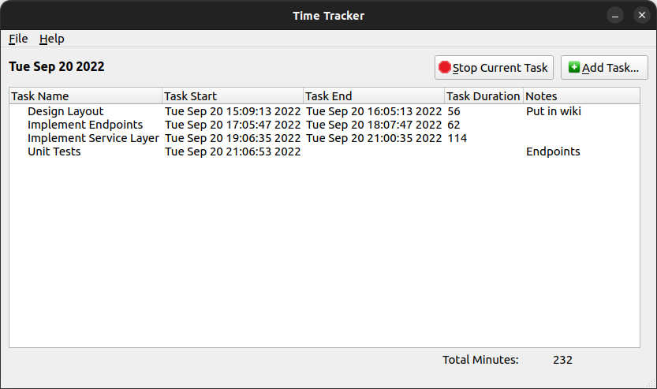

# QtTimeTracker
A (very) simple but useful time tracker to record time spent on tasks built using Qt. It's a very straight forward implementation written a long time ago that I still use to this day. Maybe this can be useful to others.



## Build
Ensure you have the Qt developer toolset installed.
```bash
qmake QTimeTracker.pro -spec linux-g++ CONFIG+=debug
```
